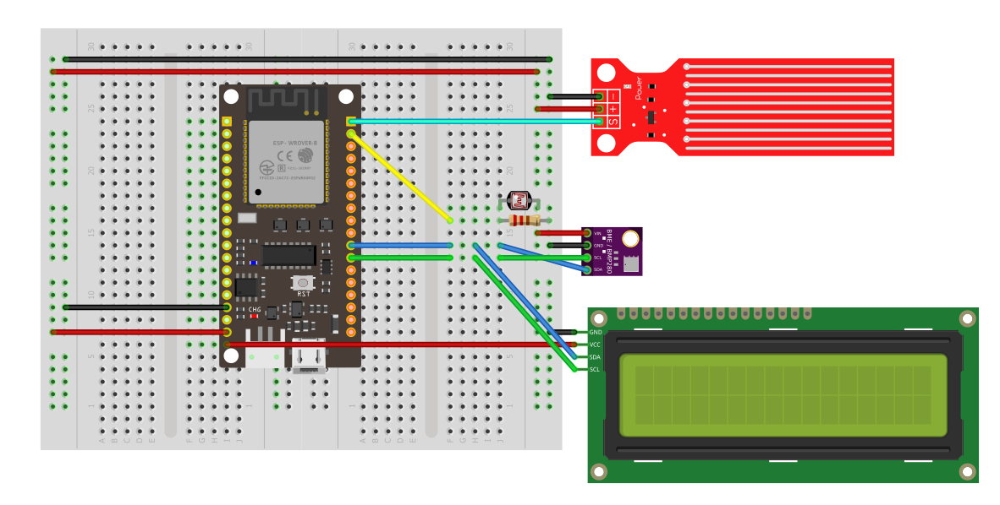
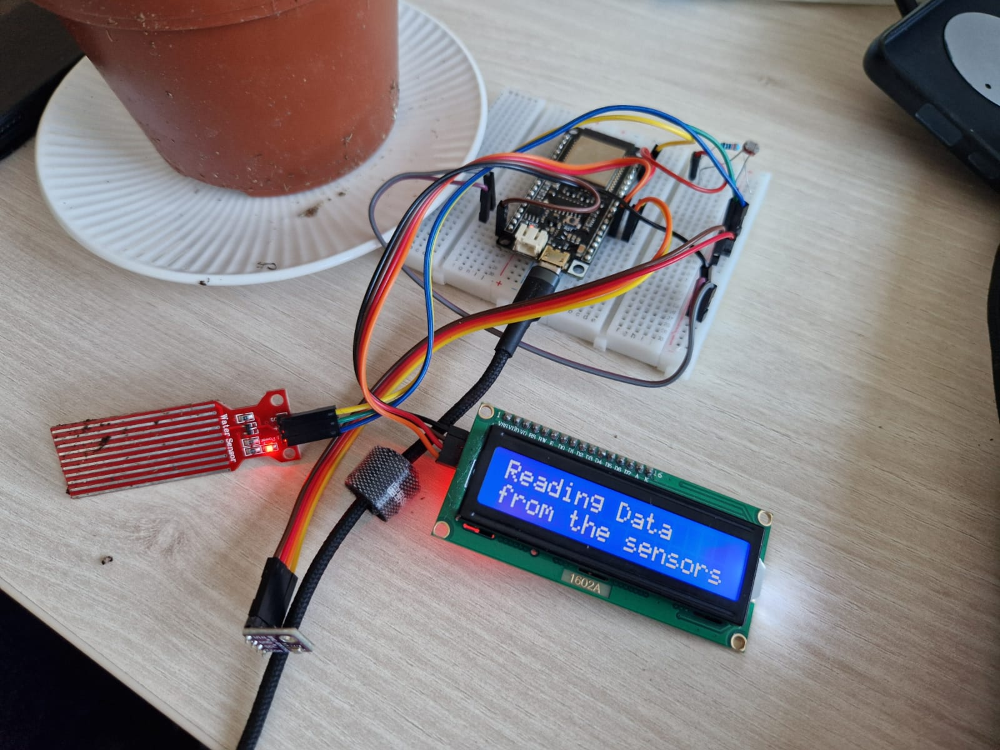
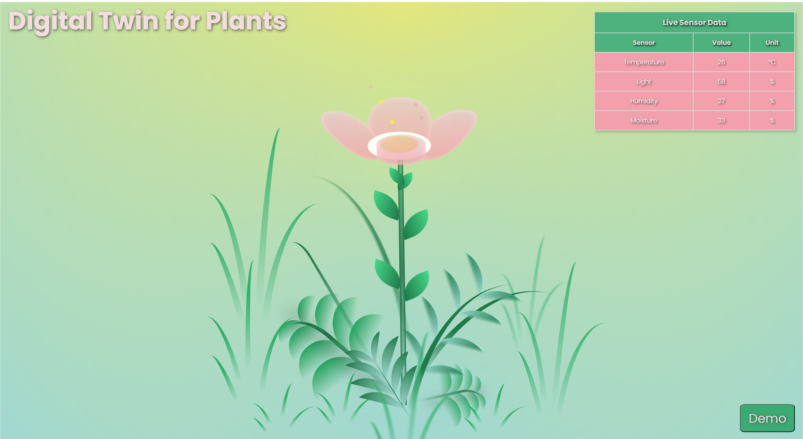

### Team Members

- Barbulet Ana-Maria
- Cacu Razvan


## Theoretical Description and Explanation

Our project focuses on implementing a versatile system that combines various sensors, such as Light Dependent
Resistors (LDRs), water sensors, and a BME280 sensor, with a display. The goal is to create a portable device that
can monitor  our plants conditions, providing real-time data on light levels, water presence, temperature, humidity,
and pressure. The system utilizes MicroPython, making it easy to deploy and program.

## Wiring Schematic



## Hardware Description of Demo Application

Our hardware setup includes:

- Microcontroller (ESP32): Serves as the brain of the system, running MicroPython.
- LCD Displays (e.g. 1602A): Displays information collected from sensors.
- Light Dependent Resistors (LDRs): Measure ambient light levels.
- Water Sensors: Detect the presence of water.
- BME280 Sensor: Measures temperature, humidity, and pressure.

## Software Description

The software consists of several components:

1. **LDR Class:**
    - Represents the Light Dependent Resistor sensor, allowing reading of light levels.
    - Source File: [ldr.py](https://github.com/rzvn01/digitalTwin/tree/main/esp32_source_files/ldr.py)
    - Usage: `ldr = LDR(pin)`

2. **WaterSensor Class:**
    - Represents the water sensor, capable of detecting water presence.
    - Source File: [water_sensor.py](https://github.com/rzvn01/digitalTwin/tree/main/esp32_source_files/water_sensor.py)
    - Usage: `water_sensor = WaterSensor(pin)`

3. **BME280 Class:**
    - Represents the BME280 sensor, providing methods for reading temperature, humidity, and pressure.
    - Source File: [bme280.py](https://github.com/rzvn01/digitalTwin/tree/main/esp32_source_files/bme280.py)
    - Usage: `bme = BME280()`

4. **WiFiManager Class:**
    - Manages Wi-Fi connectivity for the device.
    - Source File: [wifi_manager.py](https://github.com/rzvn01/digitalTwin/tree/main/esp32_source_files/wifi_manager.py)
    - Usage: `wifi_manager = WiFiManager(ssid, password)`

5. **DisplayManager Class:**
    - Manages the displays.
    - Source File: [display_manager.py](https://github.com/rzvn01/digitalTwin/tree/main/esp32_source_files/display_manager.py)
    - Usage: `displayManager = DisplayManager()`
   

## Setting Up the Hardware

1. Connect LDRs, water sensors, the BME280 sensor, and the displays to the microcontroller according to the provided
   schematic.
2. Power up the microcontroller.

## Flashing MicroPython

To use MicroPython with a real ESP32 board, you will need to follow these steps:

* Download MicroPython firmware
* Flash the firmware
* Connect to the Board's Serial REPL and interact with MicroPython
* Transfer files to the ESP32 board

There are several very good tutorials how to install and use MicroPython on an ESP microcontroller, such
as [this one](https://pythonforundergradengineers.com/how-to-install-micropython-on-an-esp32.html) for Windows. The
following text was tested under Linux-based operating system.

> **NOTE:** The MicroPython firmware can also be flashed by Thonny IDE.

1. Install [Python](https://www.python.org/downloads/).

2. Open terminal (typically `Ctrl+Alt+T`) and install `esptool`:

    ```shell
    pip install esptool
    ```

   Connect your ESP board and test
   the [`esptool`](https://docs.espressif.com/projects/esptool/en/latest/esp32/esptool/basic-commands.html#):

    ```shell
    # Get the version
    esptool.py version

    # Read chip info, serial port, MAC address, and others
    # Note: Use `dmesg` command to find your USB port
    esptool.py --port /dev/ttyUSB0 flash_id

    # Read all eFuses from the chip
    espefuse.py --port /dev/ttyUSB0 summary
    ```

**For ESP32 chips:**

3. [Download](http://micropython.org/download/) the latest firmware for your target device, such
   as `esp32-20230426-v1.20.0.bin` for Espressif ESP32.

4. Erase the Flash of target device (use your port name):

    ```shell
    esptool.py --chip esp32 --port /dev/ttyUSB0 erase_flash
    ```

5. Deploy the new firmware:

    ```shell
    esptool.py --chip esp32 --port /dev/ttyUSB0 write_flash -z 0x1000 esp32-20230426-v1.20.0.bin
    ```


## Running the Application

1. Power on the device.
2. Make sure all files are saved into microcontroller's memory.
3. The displays should show real-time data from the sensors, including light levels, water presence, temperature,
   humidity, and pressure.

> **NOTE:** The wrapper for functionality must be saved as `main.py` in order to get the desired behaviour
> for  `deepsleep()` function.



## See Results on ThingSpeak
In order to see charts of the measurements obtained from the sensors visit the following [link](https://thingspeak.com/channels/2364561).

## See Results Live on Web
In order to see analyzed results of the measurements obtained from the sensors visit the following [link](https://rzvn01.github.io/digitalTwin/).

The following page will pop-up:



A demo mode is available at the following [link](https://rzvn01.github.io/digitalTwin/test.html) that will iterate through a few of the possible themes that will appear if the values received from the servers are above/below the set thresholds.


## Troubleshooting

- If the device fails to connect to Wi-Fi, check your credentials and network availability.
- Ensure the sensors are correctly wired.
- Make sure all packages are up-to-date and not deprecated.

## Demo Video

https://github.com/user-attachments/assets/cb202cae-7384-45f1-a961-a0ba6f08e30e

## References

1. MicroPython Documentation: [MicroPython](https://micropython.org/)
2. ESP8266 Documentation: [ESP32 MicroPython](https://docs.micropython.org/en/latest/esp32/quickref.html)
3. BME280
   Datasheet: [BME280 Datasheet](https://www.bosch-sensortec.com/media/boschsensortec/downloads/datasheets/bst-bme280-ds002.pdf)
4. LCD 1602A [LCD Datash](https://hades.mech.northwestern.edu/images/f/f7/LCD16x2_HJ1602A.pdf)